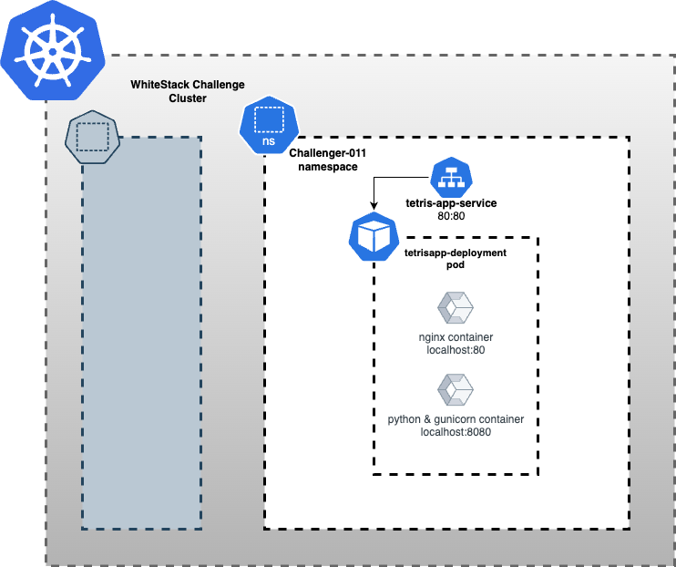

# tengen-tetris
Tengen Tetris web app using Python Flask at the backend and p5.js at the frontend

## Introduction
This project runs as a Flask server that users can interact with through their browser, by knowing the IP of the machine that is serving it, and
the port, which by default is 8080 (there is currently no easy way to modify this). It is displayed on the client side using the p5.js library.

It tries to mimic the NES Tetris experience in terms of fall speed and score assignments. The display of elements in the canvas is also
similar to NES Tetris. The duo game mode mechanics have been completely inspired by Tengen Tetris. Finally, the aesthetic has been moved to a more retro-cyberpunk vibe, as if you were playing on some old green phosphorous screen
while the world is falling apart due to the cyborg awakening.

There is a scoreboard to which players can upload their high scores and compete.


## Game modes
There are two game modes:
* Solo: select a level and start playing. You will be on your own. You can pause and quit.
You will be able to submit your high score to the server once you die.
* Duo: click on *Look for another player* and once another user does the same on their client, you will both start a duo game.
Select level at the beginning (ech of you can select its own level) and play. You will be able to see your oponent's screen on the right of yours to track
their movements. The same pieces will fall for both of you, even if you die and decide to try again.

## How to run it on your machine
Instructions can only be provided for a Linux box, sorry. Also, specific instructions are given for an Ubuntu Server, although you will be able to figure out
how to install it on any other Linux box.

1. `cd` to a new directory
2. Clone this repo with `git clone`
3. This runs on Python 3, so be sure to have that installed
4. Be sure to have `pip3` package for Python 3 dependencies installation, on Ubuntu this can be installed by running `apt install python3-pip`.
With it, install the following dependencies:
  * `pip3 install flask`
  * `pip3 install flask_socketio`
  * `pip3 install gevent-websockets`


5. Run the server with `python3 application.py` or run it on the background with `nohup python3 application.py > out.log &`
6. Open a web browser and connect to `localhost:8080`. If you can see a page, everything has worked fine.
7. Find out the IP address of your box by running `ip a`, and, from another computer within the same network, connect to `<ip>:8080`.

## How to run it using virtual environment
If you want to run this on a virtual environment, you can do so by following these steps:

1. Install `virtualenv` using the following command:

```bash
python -m pip install --upgrade pip && python -m pip install virtualenv
```
 
2. Create a virtual environment using the following command:

```bash
python -m virtualenv .venv
```

3. Activate the virtual environment using the following command:

```bash
 . ./.venv/bin/activate
```

4. Install the required dependencies using the following command:

```bash
pip install -r requirements.txt
```

5. Run the server using the following command:

```bash
python app/application.py
```

6. Deactivate the virtual environment using the following command:

```bash
deactivate
```

## How to run it using Docker
If you want to run this on a Docker container, you can do so by following step:

```bash
docker build . --tag "tetris:latest"  \
	&& docker run -d -p 8080:8080 tetris:latest
```

## How to run it using Docker Compose
If you want to run this on a Docker container using Docker Compose, you can do so by following step:

1. Create a `.env` file with the following content:

```bash
cp .env.example .env 
```
and add the values required to .env file.

2. Run the following command:

```bash
docker-compose up -d --build .
```
# Kubernetes App Architecture



## How to run it in Kubernetes Cluster
If you want to run this on a Kubernetes cluster, you can do so by following these steps:

1. build and push the Docker images to a container registry
1.1. Add the values required in .env file
1.2. Add execute permission to the script

```bash
chmod +x scripts/buildAndPush.sh
```

1.3. login to the container registry

```bash
docker login 
```

1.4. Run the script to build and push the Docker images

```bash
./scripts/buildAndPush.sh
```

2. Create the Kubernetes resources using the following command:

```bash
kubectl apply -f k8s/. --namespace <namespace>
```

2.1. Access the application using port-forwarding

```bash
kubectl port-forward <servicename> <localport>:<targetport> --namespace <namespace>
``` 

3. Delete the Kubernetes resources

```bash
kubectl delete -f k8s/. --namespace <namespace>
```

## How to deploy it on a Kubernetes clster using Helm
If you want to run this on a Kubernetes cluster using Helm, you can do so by following these steps:

1. Add the values required in `helm/values.yaml` file
2. Run the following command:

```bash
helm install <release-name> helm/ --namespace <namespace> -f helm/values.yaml
```

3. Access the application

```bash
kubectl port-forward <servicename> <localport>:<targetport> --namespace <namespace>
```

4. Delete the Helm release

```bash
helm uninstall <release-name> --namespace <namespace>
```


